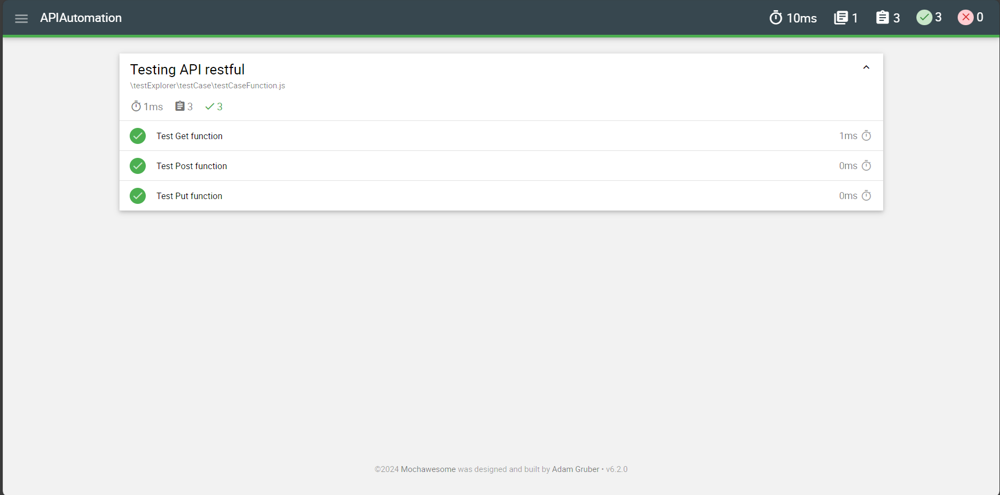

# APIAutomation

- How to run this automation

1. install dependencies using npm install
2. run command for run API Automation npm run test:mocha

- Mochawesome Report

1. Generated report shall be restore under folder report
2. Open report that has name pass_[date]-mochawesome-report.html Sample report

